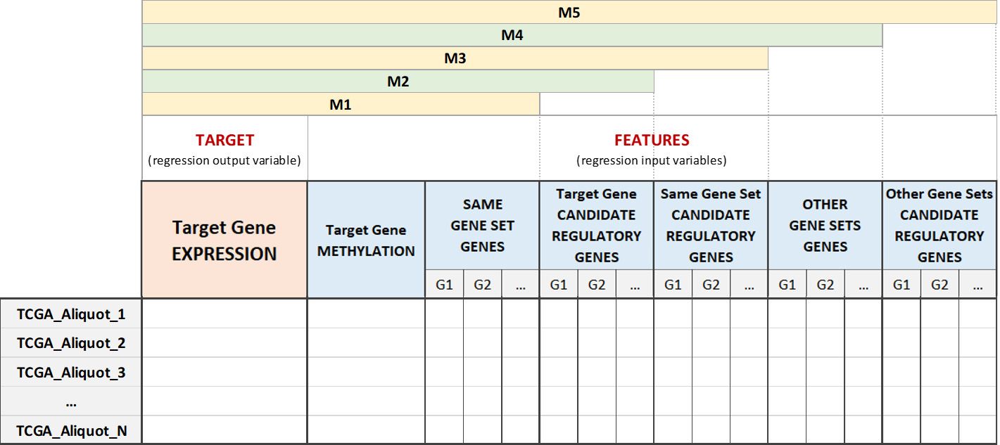

Data Matrixes Construction
============================================
Extracted data are organized in order to let them be used as input for the data analysis, such that you can analyze the single regulation system of each target gene, by identifying the role of its possible regulatory features quantified as for their impact on the target expression, whatever the feature is, e.g. the gene methylation, the expression of a gene in the same pathway or in another pathway and the expression of genes encoding for transcription factors.

An additive approach is adopted, building five different data matrixes for each gene of interest. In this way you can keep track of each gene regulation system step by step, according to the different types of biological features. More specifically, the matrixes are built starting from the gene expression and methylation value of the model gene and gradually incrementing the number of columns, as follows:

	* **Matrix M1** contains the expression of the model gene, its methylation and the expression of the genes belonging to the model gene pathway;
	
	* **Matrix M2** adds the expression of all the candidate regulatory genes of the model gene to M1, avoiding repetitions;
	
	* **Matrix M3** adds the expression of the candidate regulatory genes of all the genes in the model gene pathway to M2, avoiding repetitions;
	
	* **Matrix M4** adds the expression of the genes belonging to the other pathways with respect to the considered model gene to matrix M3, avoiding repetitions;
	
	* **Matrix M5** adds the expression of the candidate regulatory genes of all the genes belonging to the other pathways to matrix M4, avoiding repetitions.

|

Here it is the set of fuctions used to build the five data matrixes:

..  automodule:: genereg.DataMatrixes
    :members: