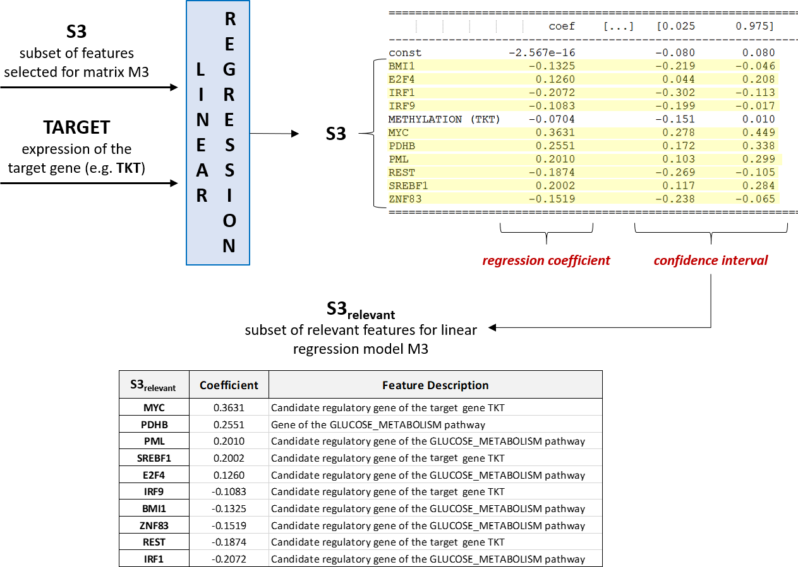

Data Analysis
============================================
In this phase all the data arranged in the previous phases are processed according to a suitable machine learning algorithm. In order to overcome potential issues related to overfitting and high computational complexity, the procedure is broken down into sub-processes with increasing complexity and a linear regression model is built for each target gene and for each one of the data matrixes previously defined, retrieving in each step only the features extracted as most relevant in the previous step.

Each model is built subsequently executing the following two steps:

	* a **FEATURE SELECTION** process (i.e. *forward feature selection*) that allows you to select the best subset of features for the model gene, removing inputs that are known to be non-significant for the regulation of the model gene expression beforehand. In particular, for each input matrix, the feature selection is performed five times: in order to reduce the bias, the set of TCGA data samples is randomly split into five, possibly equal, groups of samples which are used to create five different testing sets (this partition is indeed performed only once at the beginning of the data analysis, and then the same five subsets of samples are used for processing all the genes. Therefore, feature selection is performed five times, one for each generated testing set (using the remaining samples as training set), according to a *k-fold cross-validation* process, setting *k=5*. The intersection of the five sets of extracted features is computed to obtain the final selected features for the current gene in the current matrix.

|
|

|

and

	* a **REGRESSION** process that fits a linear model on each individual target gene and for each of its data matrixes, starting from the set of selected features as input and normalizing (i.e. *Z-score normalization*) all the data.

Here it is an example of the linear regression process for the sample gene TKT and the selection of its relevant features:

|

However, since it is possible to introduce an alteration in the results due to the order in which features are included in the models, the regression procedure implemented here is logically based only on the biological knowledge and it therefore analyzes the full M2 matrix (which in turn contains M1) at first, including all at once in the model all the features whose exchanged order could cause different results in the analysis. Subsequently, data analysis on M3 and M5 is performed, finally executing only three regression processes for each target gene, assessing the impact of the model gene patwhay first and then the influence of the other genomic pathways

The set of fuctions used to perform the analysis is the following:

..  automodule:: genereg.FeatureSelection
    :members:

	
..  automodule:: genereg.LinearRegression
    :members:

	
..  automodule:: genereg.SummaryResults
    :members:

	