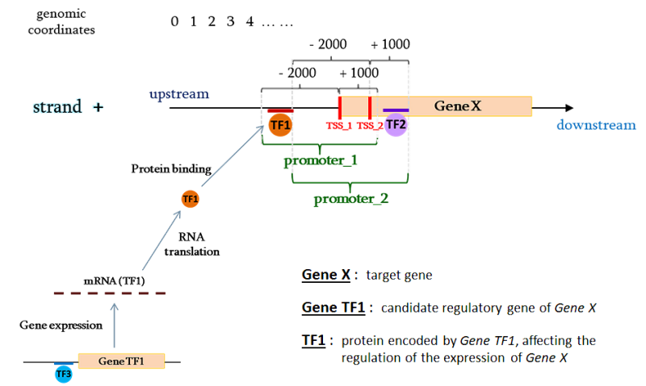
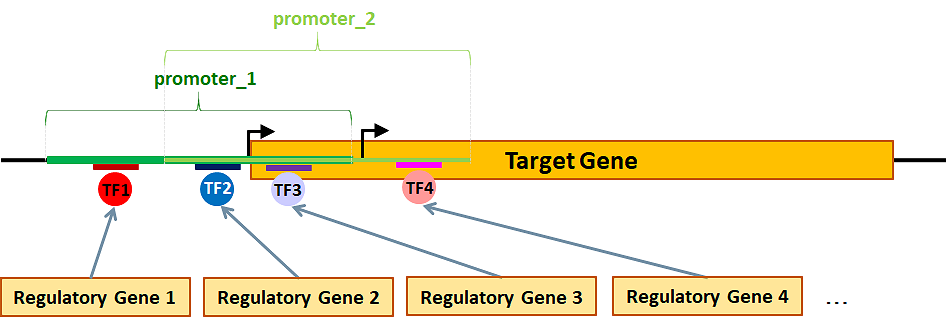

ENCODE Data Extraction
============================================
The first data extraction phase consists in selecting from ENCODE all the Transcription Factors (TFs) having binding sites located in the promoter regions of the genes of interest. Then, starting from these TFs, candidate regulatory genes for each gene of interest are identified:

The query for extracting TFs of interest is implemented according to the `PyGMQL <https://pygmql.readthedocs.io/en/latest/index.html>`_ syntax and data are retrieved from public datasets available on the `GMQL <http://www.gmql.eu/gmql-rest/>`_
system.

|

-------------------------------------
Extraction of Transcription Factors
-------------------------------------

``extract_tfs(cell_lines, gencode_version)``

	The EXTRACT_TFS operation extracts, from ChIP_Seq ENCODE experiments and for assembly GRCh38, the Transcription Factors of specific cell lines that bind to promoter regions of genes in the specified version of the GENCODE genomic annotations; it filters the considered experiments by 'conservative idr thresholded peaks' in order to extract higher quality region data, removing experiment data with negative audits in order to keep only high quality data samples. Intermediate result files are exported locally during the execution of the function, while the final set of transcription factors is returned as a Python dictionary (dict_GeneTF.p), where each target gene (set as key) is associated with the list of TFs that bind to its promoters (set as value).
	
	**Parameters:**
	
	* *cell_lines*: a list of strings containing the names of the cell lines to analyze (it is possible to consider data from 1 up to 3 cell lines at the same time)
	
	* *gencode_version*: number representing the GENCODE genomic annotations to use (currently, for assembly GRCh38, versions 22, 24 and 27 are available in the GMQL system and can be used in this library. As soon as new versions are available in the system, you will be able to use them in this function)
	
	**Return:** a Python dictionary
	
	**INPUT FILES:** Genes_of_Interest.xlsx from *./*
	
	**OUTPUT_FILES:** `dict_GeneTF.p <https://github.com/Kia23/genereg/raw/master/DATA/sample_files/dict_GeneTF.p>`_, `dict_GeneTF.xlsx <https://github.com/Kia23/genereg/raw/master/DATA/sample_files/dict_GeneTF.xlsx>`_, `dict_GeneTF.txt <https://raw.githubusercontent.com/Kia23/genereg/master/DATA/sample_files/dict_GeneTF.txt>`_ in *./1_Transcription_Factors/* (click on the file names to download an example)
	
	Example::

		import genereg as gr
		tfs_dict = gr.TranscriptionFactors.extract_tfs(cell_lines=['K562','MCF7'], gencode_version=22)

|

-------------------------------------
Identification of Regulatory Genes
-------------------------------------

``extract_regulatory_genes()``

	The EXTRACT_REGULATORY_GENES operation extracts from the set of Transcription Factors associated with a gene, the list of its candidate regulatory genes, i.e., the genes that encode for those TFs. Intermediate results files are exported locally during the execution of the function, while the final set of transcription factors is returned as a Python dictionary (dict_RegulGenes.p), where each target gene (set as key) is associated with the list of its candidate regulatory genes (set as value).
	
	**Return:** a Python dictionary
	
	**INPUT FILES:** Genes_Mapping.xlsx from *./0_Genes_Mapping/*, dict_GeneTF.p from *./1_Transcription_Factors/*
	
	**OUTPUT_FILES:** `dict_RegulGenes.p <https://github.com/Kia23/genereg/raw/master/DATA/sample_files/dict_RegulGenes.p>`_, `dict_RegulGenes.xlsx <https://github.com/Kia23/genereg/raw/master/DATA/sample_files/dict_RegulGenes.xlsx>`_, `dict_RegulGenes.txt <https://raw.githubusercontent.com/Kia23/genereg/master/DATA/sample_files/dict_RegulGenes.txt>`_, `Full_TFs-RegulatoryGenes_SUMMARY_Table.xlsx <https://github.com/Kia23/genereg/raw/master/DATA/sample_files/Full_TFs-RegulatoryGenes_SUMMARY_Table.xlsx>`_ in *./2_Regulatory_Genes/* (click on the file names to download an example)
	
	Example::

		import genereg as gr
		reg_genes_dict = gr.RegulatoryGenes.extract_regulatory_genes()

|

The following image explains how the extraction process for each target gene works and how the target gene's TFs and regulatory genes are identified:

