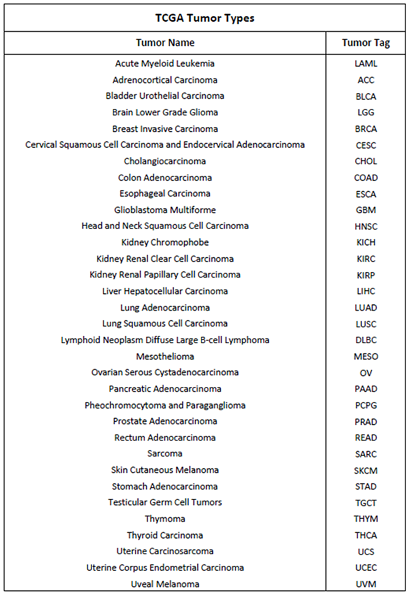

Introduction
============================================
This library implements a method for analyzing the regulation systems of target genes in a specific genetic pathology, such as cancer. Adopting a linear regression approach, it builds a predictive model for the regulation of target genes expression, in order to identify the relevant features that better explain the regulation of each gene of interest within patients under analysis.

The regulation system of each target gene is analyzed singularly and independently, by assessing the effect of some specific factors on its expression:
	
	* **DNA methylation** (more specifically, the mean promotorial methylation level of the target gene);
	
	* **expression of target genes** belonging to the **same gene set** as the model gene;
	
	* **expression of target genes** belonging to the **other gene sets** with respect to the model gene;
	
	* **expression of candidate regulatory genes** (i.e. those genes encoding for transcription factors having binding sites located in the promoter regions of genes of interest).

Methylation, gene expression and transcription factors data of interest are extracted from the `GMQL <http://gmql.eu/gmql-rest/>`_ system, using the Python library `PyGMQL <https://pygmql.readthedocs.io/en/latest/index.html>`_.
ENCODE and TCGA are the datasets currently available on GMQL for this type of data; so, this method can be used to investigate all the 33 types of cancer analyzed by TCGA:

This method allows to analyze the beavior of specific human genes within cancer patients, investigating the biological relationships which hold among each other and the effect that heterogeneous regulatory elements have on their expression.

The matter is understanding the relationships between the activity of each target gene and the genes belonging either to the same gene set or to the other relevant sets, and the relationships between all such target genes and their candidate regulatory genes: this may lead to identify common or frequent regulators with a key role in the regulation systems of the genes of interest, eventually predicting their potential oncogenic role. Whenever a correlation exists, an assessment of the potential influence that the gene methylation may have on its expression is also made.

Analyzing all the features is usually extremely heavy from a computational standpoint, resulting in a high computational complexity. For this reason, in order to make this analysis sustainable within reasonable time and using standard computational resources, the approach implemented in this library does not analyze all the existing correlations among target genes and their regulatory features, but it identifies those associations that best contribute to the target genes expression regulation.
The results are focused by design to the **best-predicting sets of features**, leaving out potential regulators with important biological functions, but with an extremely low predictive power with respect to the expression of the target gene.

The main phases that are performed during the complete execution of this method are the following:

	1) extraction of the Transcription Factors (TFs) binding to target genes promoters (from the ENCODE dataset);	
	
	2) identification of candidate regulatory genes for each target gene;
	
	3) extraction of the promotorial methylation sites and of their methylation levels (i.e. *beta_values*) for each target gene (from TCGA data samples collecting information on patients affected by the tumor of interest);
	
	4) extraction of the expression values of each target gene (from TCGA data sample collecting information on patients affected by the tumor of interest);
	
	5) extracted data manipulation and storage into data matrixes to use as inputs for the data analysis;
	
	6) data analysis process (feature selection + linear regression)

The next chapters of the documentation deeply explain the rationale behind each phase and how it is executed.

|

This method has been developed and validated at first for assessing the behavior of 177 target genes belonging to three relavant pathways (DNA_REPAIR, STEM_CELLS and GLUCOSE_METABOLISM) for the ovarian cancer, more specifically the *Ovarian Serous Cystadenocarcinoma*.
All the examples in this documentation refers to this specific ovarian cancer case.

You can see here a sample Python script for using the library::

	import genereg as gr
	
	# Initialization
	gr.Initialize.library_init()
	
	# ENCODE Data Extraction
	mapping_df = gr.GenesMapping.genes_mapping()
	tfs_dict = gr.TranscriptionFactors.extract_tfs(cell_lines=['K562','MCF7'], gencode_version=22)
	reg_genes_dict = gr.RegulatoryGenes.extract_regulatory_genes()
	
	# TCGA Data Extraction
	methyl_df = gr.Methylation.extract_methylation(tumor='Ovarian Serous Cystadenocarcinoma', platform=27, gencode_version=22, methyl_upstream=4000, methyl_downstream=1000)
	expr_df1, expr_df2 = gr.GeneExpression.extract_expression(tumor='Ovarian Serous Cystadenocarcinoma', platform=27, gencode_version=22)
	
	# Data Matrixes
	m1_dict = gr.DataMatrixes.create_m1()
	m2_dict = gr.DataMatrixes.create_m2()
	m3_dict = gr.DataMatrixes.create_m3()
	m4_dict = gr.DataMatrixes.create_m4()
	m5_dict = gr.DataMatrixes.create_m5()
	
	# Data Analysis
	# (these functions work by gene set and by model, so they have to be executed multiple times changing the input parameters
	#  according to the gene set you want to analyze and the model you want to build)
	gr.FeatureSelection.feature_selection(gene_set='STEM_CELLS', n_data_matrix=2, type=ffs_default)
	gr.FeatureSelection.feature_selection(gene_set='STEM_CELLS', n_data_matrix=3, type=ffs_default)
	gr.FeatureSelection.feature_selection(gene_set='STEM_CELLS', n_data_matrix=5, type=ffs_default)
	gr.FeatureSelection.feature_selection(gene_set='DNA_REPAIR', n_data_matrix=2, type=ffs_default)
	gr.FeatureSelection.feature_selection(gene_set='DNA_REPAIR', n_data_matrix=3, type=ffs_default)
	gr.FeatureSelection.feature_selection(gene_set='DNA_REPAIR', n_data_matrix=5, type=ffs_default)
	# [...]
	gr.LinearRegression.linear_regression(gene_set='STEM_CELLS', n_data_matrix=2)
	gr.LinearRegression.linear_regression(gene_set='STEM_CELLS', n_data_matrix=3)
	gr.LinearRegression.linear_regression(gene_set='STEM_CELLS', n_data_matrix=5)
	gr.LinearRegression.linear_regression(gene_set='DNA_REPAIR', n_data_matrix=2)
	gr.LinearRegression.linear_regression(gene_set='DNA_REPAIR', n_data_matrix=3)
	gr.LinearRegression.linear_regression(gene_set='DNA_REPAIR', n_data_matrix=5)
	# [...]
	
	# Summarize Results
	gr.SummaryResults.summarize_reg(gene_set='STEM_CELLS', n_data_matrix=2)
	gr.SummaryResults.summarize_reg(gene_set='STEM_CELLS', n_data_matrix=3)
	gr.SummaryResults.summarize_reg(gene_set='STEM_CELLS', n_data_matrix=5)
	gr.SummaryResults.summarize_reg(gene_set='DNA_REPAIR', n_data_matrix=2)
	gr.SummaryResults.summarize_reg(gene_set='DNA_REPAIR', n_data_matrix=3)
	gr.SummaryResults.summarize_reg(gene_set='DNA_REPAIR', n_data_matrix=5)
	# [...]
	gr.SummaryResults.summarize_r2(gene_set='STEM_CELLS')
	gr.SummaryResults.summarize_r2(gene_set='DNA_REPAIR')
	# [...]
	gr.SummaryResults.best_genes(gene_set='STEM_CELLS')
	gr.SummaryResults.best_genes(gene_set='DNA_REPAIR')
	# [...]

	
**Note:** Changing the input parameters of each function above, you can easily execute the full method on data you are interested in.
As explained next, it is extremely important to define the *library workspace* and the file containing your target genes (see *Initialization* section).
