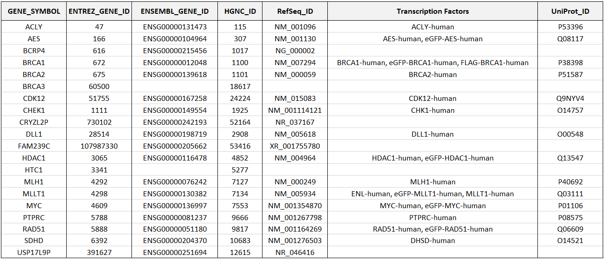

Gene - TFs Mapping
============================================
As comprehensive information on human genes is available online through multiple heterogeneous sources, it is useful to have it integrated into a unique spreadsheet to be queried whenever required during the data extraction, manipulation and analysis processes.

``genes_mapping()``

	The GENES_MAPPING operation creates a mapping table for all the human genes (downloaded from HGNC), providing their current official Gene Symbols, their main IDs, and, if existing, the transcription factors they encode (with their corresponding UniProt IDs). The mapping table is returned as a Pandas dataframe and exported locally in the Excel file 'Genes Mapping.xlsx'.
	
	**Return:** a Pandas dataframe
	
	**INPUT FILES:** ENCODE.tsv, UNIPROT.tsv, HGNC.tsv from *./0_Genes_Mapping/DATA/*
	
	**OUTPUT_FILES:** Genes Mapping.xlsx (download an example `here <https://github.com/Kia23/genereg/raw/master/DATA/sample_files/Genes%20Mapping.xlsx>`_)
	
	Example::

		import genereg as gr
		mapping_df = gr.GenesMapping.genes_mapping()

Here it is a sample excerpt of the final GENEs-TFs mapping table:

