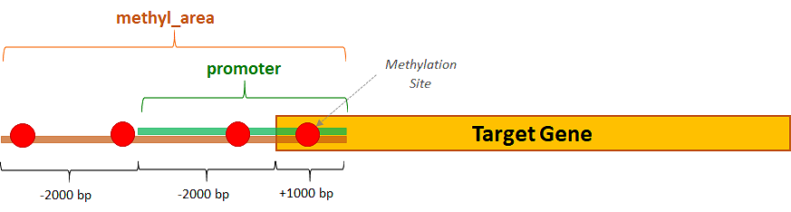

TCGA Data Extraction
============================================
The second data extraction phase consists in extracting from TCGA data related to the cancer type under analysis: in particular, for each target gene its methylation level (expressed as the **mean** of its *beta_values*) and its gene expression (measured in *fpkm*) are retrieved.

The queries for extracting methylation and gene expression data of interest are implemented acconding to the `PyGMQL <https://pygmql.readthedocs.io/en/latest/index.html>`_ syntax and data are retrieved from public datasets available on the `GMQL <http://gmql.eu/gmql-rest/>`_
system.

As for cancer patients under analysis, only common data samples having both methylation and expression values in TCGA are selected. Each data sample corresponds to a specific patient, which is here identified by a unique string, called *Sample Barcode*, with the following structure: **TCGA-xx-xxxx-xxx**.

-------------------------------------
Extraction of Methylation values
-------------------------------------

..  automodule:: Methylation
    :members:

|

Methylation sites of interest are the ones falling within slightly wider areas than the target genes promoters, going from 4000 bases upstream to 1000 bases downstream from the TSSs of the genes of interest:

This because the methylated promoter mostly influences the gene expression regulation, by considerably reducing the expression. Methylation sites localized in other genomic regions of the target genes are out of the scope of this analysis.

Here is a sample excerpt of the final methylation values table, containing TCGA data samples as rows and target genes as columns:

.. image:: images/methylval.png

|

-------------------------------------
Extraction of Gene Expression values
-------------------------------------

..  automodule:: GeneExpression
    :members:

