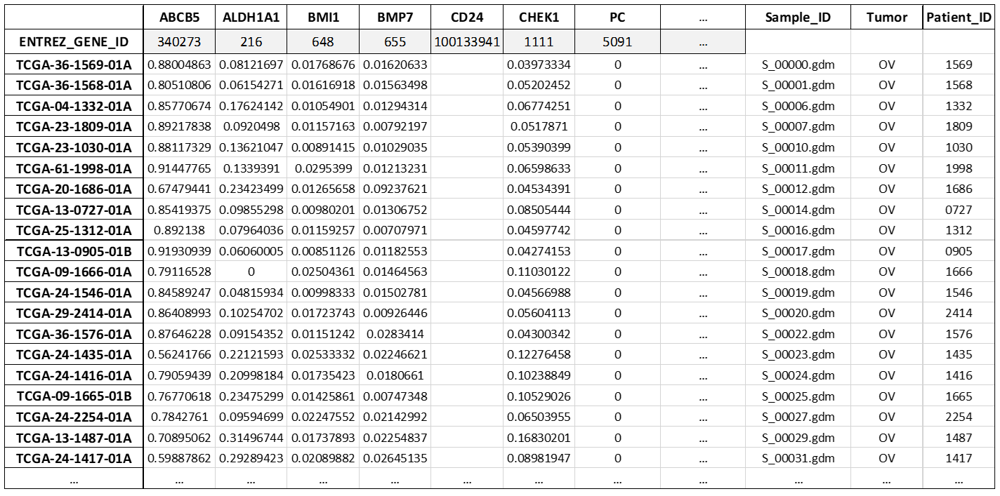

TCGA Data Extraction
============================================
The second data extraction phase consists in extracting the methylation level (expressed as the **mean** of its *beta_values*) and the gene expression value of each target gene and for each data sample under analysis.
These types of data are currently available in GMQL for the TCGA dataset, which is the one that is used in this method.

The queries for extracting methylation and gene expression data of interest are implemented according to the `PyGMQL <https://pygmql.readthedocs.io/en/latest/index.html>`_ syntax and data are retrieved from public datasets available on the `GMQL <http://gmql.eu/gmql-rest/>`_
system.

Only common data samples having both methylation and expression values in TCGA are selected. Each data sample corresponds to a specific patient, which is here identified by a unique string, called *TCGA Aliquot*, with the following structure: **TCGA-xx-xxxx-xxx**.

-------------------------------------
Extraction of Methylation values
-------------------------------------

``extract_methylation(tumor, platform, gencode_version, methyl_upstream, methyl_downstream)``

	The EXTRACT_METHYLATION operation extracts methylation values from TCGA for all the genes of interest. For each gene of interest, the mean value of all the beta_values associated to methylation sites that are localized within areas -methyl_upstream/+methyl_downstream bases from its TSSs are retrieved. Intermediate results files are exported locally during the execution of the function, while the final dataframe is returned as a Pandas dataframe and exported locally in the Excel file 'Methylation Values.xlsx'.
	
	**Parameters:**
	
	* *tumor*: full name of the tumor of interest, encoded as a string (e.g. 'Ovarian Serous Cystadenocarcinoma', 'Breast Invasive Carcinoma', ...)
	
	* *platform*: number identifying the sequencing platform (either 27 for the 27k probes sequencing platform or 450 for the 450k probes sequencing platform)
	
	* *gencode_version*: number representing the GENCODE genomic annotations to use (currently, for assembly GRCh38, versions 22, 24 and 27 can be used)
	
	* *methyl_upstream*: number of bases upstream each gene TSS to consider for the extraction of methylation sites of interest
	
	* *methyl_downstream*: number of bases downstream each gene TSS to consider for the extraction of methylation sites of interest
	
	**Return:** a Pandas dataframe
	
	Example::

		import genereg as gr
		methyl_df = gr.Methylation.extract_methylation(tumor='Ovarian Serous Cystadenocarcinoma', platform=27, gencode_version=22, methyl_upstream=4000, methyl_downstream=1000)

|

Here it is an example of extraction: in this case the methylation sites of interest are the ones falling within slightly wider areas than the target genes promoters, going from 4000 bases upstream to 1000 bases downstream from the TSSs of the genes of interest:

.. image:: images/methyl.png

This interval can be useful, for example, for assessing the impact of a methylated promoter on the target gene, which participates in considerably reducing the gene expression.

Here it is a sample excerpt of the final methylation values table, containing TCGA data samples as rows and target genes as columns:

|

-------------------------------------
Extraction of Gene Expression values
-------------------------------------

``extract_expression(tumor, platform, gencode_version)``

	The EXTRACT_EXPRESSION operation extracts expression values from TCGA for all the genes of interest and their candidate regulatory genes. Intermediate results files are exported locally during the execution of the function, while the final dataframes are returned as Pandas dataframes and exported locally in the Excel files 'Gene Expression - InterestGenes.xlsx' and 'Gene Expression - RegulatoryGenes.xlsx'.
	
	**Parameters:**
	
	* *tumor*: full name of the tumor of interest, encoded as a string (e.g. 'Ovarian Serous Cystadenocarcinoma', 'Breast Invasive Carcinoma', ...)
	
	* *platform*: number identifying the sequencing platform (either 27 for the 27k probes sequencing platform or 450 for the 450k probes sequencing platform)
	
	* *gencode_version*: number representing the GENCODE genomic annotations to use (currently, for assembly GRCh38, versions 22, 24 and 27 can be used)
	
	**Return:** two Pandas dataframes
	
	Example::

		import genereg as gr
		expr_interest_df, expr_regul_df = gr.GeneExpression.extract_expression(tumor='Ovarian Serous Cystadenocarcinoma', platform=27, gencode_version=22)

